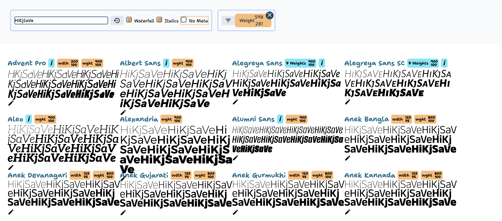

# Better Google Fonts



# How to Run
## installation

Clone this repo and the subrepo fonts (which is google fonts itself)
```
git clone --recurse-submodules https://github.com/akkurat/bettergooglefonts.git
```
(submodule will take it's time as it is ~1GB to clone)


## combine all meta font data into one fat json
Installation is needed for protobuf parser
```bash
npm i
node gf.js bettergooglefontsng/assets/
```

## start angular app to serve font files and overview
```bash
cd bettergooglefontsng
npm i
ng serve
```

# Roadmap
## Bugish
* Axes to not trigger filter when added

## Reasonable TODOs
* Questionaire: Initialize localstorage from classification.json. could be even done automatically for keys that exist only locally or in .json. 
* Questionaire: Characterizations for Serif fonts
* Checkbox to in- or exclude fonts without the respective axis availabe
* Map standard axis to discrete values (e.g. weight, width, slant/ italic angle)
* Detailview of font with something like this [https://www.axis-praxis.org/specimens/__DEFAULT__] -> Quickwin: Link to google fonts for now
* Custom specimen text
* Grid/List view
* Size / Width/ Weight Waterfall

## Fancy Todos
(not necessarily hard to implement, but lower prio)
* Show number filtered Fonts due to Range or Selection Filter
* [Sankey Diagram](https://en.wikipedia.org/wiki/Sankey_diagram) for filtering path
* [Venn Diagram](https://en.wikipedia.org/wiki/Venn_diagram) for font properties (e.g. which fonts have a helvetica like K, double story g and and are real italics)
* woff generator


# Limitations
* Scrolling through all fonts results in a traffic of roughly 1GB as all fonts are taken directly from the repo as ttf/otf without web optimization. Hence it's not possible yet to serve it remotely due to bad performance and unbeareable traffic costs -> Github page ftw!


# Structure

## Data consolidation
### Sources of Information
* FONTMETA.pb: Axes Information, Font Styles, Filepath of the font
* axisregistry: Metainfos on Axis (not yet used in GUI but .pb files are parsed)
* tags/all/families.csv: Tagging Info more detailed than just serif / sans (not yet used)
* classification.json

### Offline computing
* All FONTMETA.pb files (protobuf files) are parse by the nodescript gf.js and wrote into ```bettergooglefontsng/src/assets/fontmeta.json``` (parameter of the script)
* All *.pb files in the axisregistry/data are merged into ```bettergooglefontsng/src/assets/axismeta.json```
* classification.json is copied from 'http://localhost:4200/classify-json' 

### App 
* At startup an in-memory minimongo db is setup with the contents of fontmeta.json and classification.json merged together
* Afterwards filtering is done via mongo queries

### Questionnaire
* To classify a font use (http://localhost:4200/classify/paprika)
* The answers are written into localstorage
* To contribute classifications go to http://localhost:4200/classify-json and copy the contents into classification.json

## Angular App
* mongofont.service.ts -> Has the meta data
* fontoverview -> listing fonts, main routing
* fontpreview -> One tile in the listing
* fontfilters -> upper part of fontoverview
* classifier -> questionnaire
